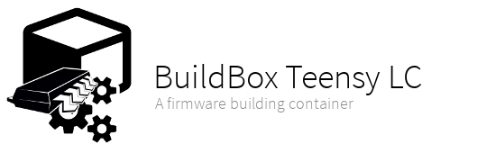

This is a Docker container for building C/C++ firmwares for the Teensy LC.
The Teensy LC (Cortex-M0+) processor is supported.

- [Quick Start](#quick-start)
- [Image Building](#image-building)

## Quickstart

To build a project with the ARM toolchain run the container like this:

```bash
$ docker run --rm -v `pwd`:/share -w /share \
    jack12816/buildbox-teensy-lc make build
```

The command **make build** is just an example and must be replaced with
your own build command.

The ARM toolchain includes these binaries:
```arm-none-eabi-addr2line arm-none-eabi-c++ arm-none-eabi-dwp arm-none-eabi-gcc
arm-none-eabi-gcc-nm arm-none-eabi-gcov-tool arm-none-eabi-ld arm-none-eabi-nm
arm-none-eabi-ranlib arm-none-eabi-size arm-none-eabi-ar arm-none-eabi-c++filt
arm-none-eabi-elfedit arm-none-eabi-gcc-6.3.0 arm-none-eabi-gcc-ranlib
arm-none-eabi-gdb arm-none-eabi-ld.bfd arm-none-eabi-objcopy
arm-none-eabi-readelf arm-none-eabi-strings arm-none-eabi-as arm-none-eabi-cpp
arm-none-eabi-g++ arm-none-eabi-gcc-ar arm-none-eabi-gcov arm-none-eabi-gprof
arm-none-eabi-ld.gold arm-none-eabi-objdump arm-none-eabi-run
arm-none-eabi-strip```

## Image Building

Just clone this git repository and run `make`. It will show up a complete
documentation of all available commands. The default workflow is the following:

    build -> release -> publish

If you expecting any issues while testing the newly built image after release
run `make clean` and start over. All commands are idempotent and can be
executed multiple times with the same result. (Just keep in mind that the
release process will always increase the version number)
